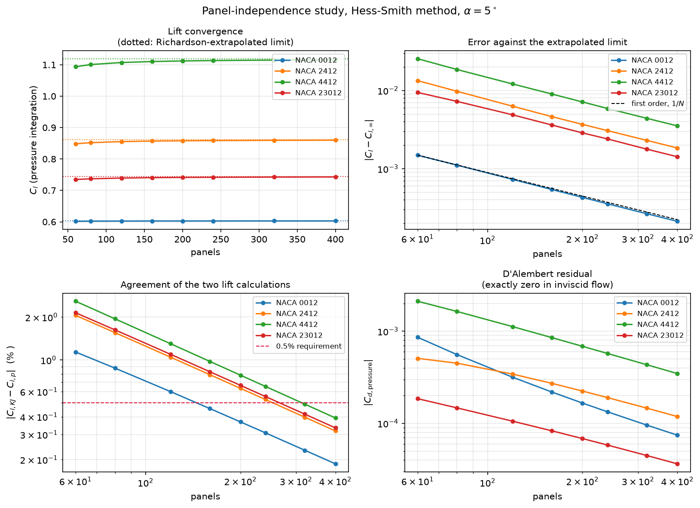

# aerolab

A 2D/3D subsonic aerodynamics toolkit — the virtual half of a small
aerodynamic testing facility. The other half is a physical open-circuit wind
tunnel; Phase 7 is the bridge between them.

The goal is not "code that produces plots". It is a solver whose error bounds
are known, stated, and validated against published data.

## Status

| Phase | Scope | State |
|---|---|---|
| 0 | Environment, package skeleton, test harness | **complete** |
| 1 | Geometry: NACA generators, `.dat` import, repaneling | **complete** |
| 2 | Inviscid 2D: Hess–Smith panel method | **complete** |
| 3 | Viscous: integral boundary layer, transition, profile drag | **complete** |
| 4 | Viscous–inviscid coupling via transpiration | wake built; iteration limit-cycles in the last 1% of chord — [`NOTES.md`](NOTES.md) L4.3 |
| 5 | Polars, CLI, PDF reporting, compressibility corrections | **complete** |
| 6 | Finite wings: vortex lattice | **complete** |
| 7 | Tunnel corrections and experimental validation | **complete** |

## Install

Requires [miniforge](https://github.com/conda-forge/miniforge) (or any conda).

```bash
conda env create -f environment.yml
conda activate aerolab
pip install -e ".[dev]"
```

## Use

```bash
aerolab version
```

```python
from aerolab.geometry import naca, repanel, read_dat, Panels

af = naca("2412")                     # 4- and 5-digit, analytic camber lines
af.max_thickness                      # Extremum(value=0.1200, x=0.2982)
af.le_radius, af.area, af.te_gap

coarse = repanel(af, 161)             # cosine-clustered, independent LE/TE control
panels = Panels(coarse)               # control points, tangents, outward normals

imported = read_dat("s1223.dat")      # Selig/Lednicer detected, not guessed
imported.detected_format              # 'lednicer'
```

```python
import numpy as np
from aerolab.geometry import naca
from aerolab.inviscid import HessSmithSystem

system = HessSmithSystem(naca("2412", 401))   # factorised once
sol = system.solve(np.deg2rad(5.0))           # alpha in RADIANS

sol.cl_pressure, sol.cl_kutta_joukowski       # two independent routes
sol.cm_quarter_chord                          # positive nose-up
sol.cd_pressure                               # ~0 by D'Alembert: an error measure
sol.cp, sol.control_points                    # surface pressure distribution
sol.velocity_at([[2.0, 0.5]])                 # field query anywhere

# A sweep costs no further factorisations: the freestream enters linearly.
sols = system.solve_sweep(np.deg2rad(np.arange(-6, 16, 0.5)))
```

`solve()` **refuses** to return a result whose two lift calculations disagree by
more than 0.5%; pass `validate=False` to override deliberately.

```python
from aerolab.viscous import solve_boundary_layer

bl = solve_boundary_layer(sol, reynolds=3e6, n_crit=9.0)   # or method="michel"
bl.cd_profile                                  # Squire-Young profile drag
bl.upper.transition_x, bl.upper.theta          # per-surface development
bl.upper.laminar_separation_x                  # lambda <= -0.0842
bl.upper.turbulent_separation_x                # H > 2.6
```

`n_crit` is the knob to calibrate against a real tunnel: 9 is free flight,
4–7 a small open-circuit tunnel. It moves the drag by **32%** across that range,
which is far more than any other modelling choice — see `NOTES.md`, L3.3.

## Command line

```bash
aerolab polar --airfoil naca2412 --re 5e5 --alpha -6:16:0.5 --out polar.csv
aerolab batch --airfoils naca0012,naca2412,naca4412 --re 2e5,1e6 --out polars/
aerolab report --airfoil naca2412 --re 5e5 --out report.pdf
aerolab geometry --airfoil naca23012
aerolab wing --airfoil naca2412 --re 5e5 --span 6 --taper 0.5 --out wing.csv
aerolab tunnel --measured run.csv --predicted polar.csv --height 0.3 --chord 0.1
```

Angles are in **degrees** here and in the CSV — that is the boundary where this
package converts. Exit code 2 means the run finished but some points were
flagged, so a script can tell a clean run from one with caveats.

`--mach` applies a Kármán–Tsien (or `--correction prandtl-glauert`) correction
and flags any point whose local Mach exceeds 0.7.

`--n-crit` is worth calibrating **only above about Re = 5×10⁵**. Below that the
laminar layer separates before the amplification factor reaches N, so transition
is set by the separation bubble and the parameter has no effect at all — see
`NOTES.md`, L7.5.

## Running a tunnel test

`tunnel_test/` holds a complete first experiment: a NACA 0012 model at 100 mm
chord (coordinates in `.dat` and in millimetres for CAD), predicted polars, and
a blank measurement sheet to fill in from the balance.

## Test

```bash
pytest
```

## Panel-independence study



The method is first order — error halves as panels double. Regenerate with:

```python
from aerolab.validation.panel_independence import run_panel_study, plot_panel_study
studies = [run_panel_study(c, 5.0) for c in ("0012", "2412", "4412", "23012")]
plot_panel_study(studies, "docs/panel_independence.png")
```

## Conventions

Angles are in **radians** at every function boundary; degrees appear only in
the CLI, in file formats, and on plot axes. Airfoil coordinates are
non-dimensionalised by chord. Pitching moment is positive nose-up about the
quarter chord. The full table is in [`NOTES.md`](NOTES.md).

## `NOTES.md`

Every modelling assumption and every known limitation is recorded in
[`NOTES.md`](NOTES.md) as it is made. Read it before trusting a number.
